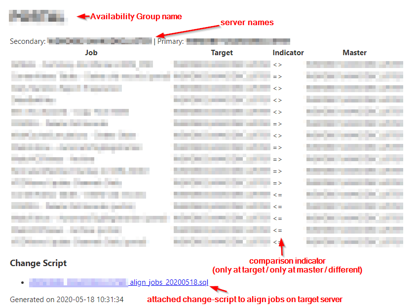

# Compare-AGReplicaJobs
    
Compare SQL Server Scheduled Jobs between Availability Group Replicas.

Function: `Compare-AGReplicaJobs`

Author: [Eitan Blumin (@EitanBlumin)](https://www.eitanblumin.com)

© [Madeira Data Solutions (@Madeira_Data)](https://www.madeiradata.com)

License: [MIT License](LICENSE)
    
## Description

`Compare-AGReplicaJobs` Compares SQL Scheduled Jobs between Availability Group Replicas, based on the specified database context of each job step.

The cmdlet performs the following operations:

- Connects to the specified `ComputerName` and detects any configured **Availability Groups**.
- Detects the relevant replica **databases** and **replica servers** of each Availability Group.
- Connects to each AG replica and compares the relevant **scheduled jobs** between each secondary and primary replica.
- Generate a **report in HTML** summarizing the differences.
- Generate **DROP/CREATE change-scripts** to be applied to each secondary replica in order to "align" them to their primary counterpart.
- **Send an e-mail** message containing the HTML report, with the relevant change-scripts as attachments.
    

    
## Syntax

```
Compare-AGReplicaJobs
 [ -emailFrom ] <String>
 [ -emailTo ] <String[]>
 [ [ -emailServerAddress ] <String> ]
 [ [ -ComputerName ] <String> ]
 [ [ -emailServerPort ] <Int32> ]
 [ [ -emailCredential ] <PSCredential> ]
 [ [ -outputFolder ] <String> ]
 [ [ -JobCategories ] <String[]> ]
 [ -emailUseSSL ]
 [ <CommonParameters> ]
``` 
    

## Parameters

`-emailFrom <String>` Specifies the e-mail address of the sender.

Aliases: `From, Sender, EmailSender`
 
Property|Value
---|---
Required?|false
Position?|1
Default value|none
Accept pipeline input?|false
Accept wildcard characters?|false
        
`-emailTo <String[]>` Specifies a list of one or more e-mail addresses for the recipients.

Aliases: `To, Recipients, EmailRecipients`

Property|Value
---|--- 
Required?|false
Position?|2
Default value|@()
Accept pipeline input?|false
Accept wildcard characters?|false
        
`-emailServerAddress <String>` Specifies an address for the SMTP server to use for sending the e-mail.

Aliases: `EmailServer, SMTPServer, SMTP`

Property|Value
---|--- 
Required?|false
Position?|3
Default value|$PSEmailServer
Accept pipeline input?|false
Accept wildcard characters?|false
        
`-ComputerName <String>` Specifies the SQL Server name to connect to and investigate.

Aliases: `CN, MachineName, SQLServer, ServerName`

Property|Value
---|--- 
Required?|false
Position?|4
Default value|.
Accept pipeline input?|false
Accept wildcard characters?|false
        
`-emailServerPort <Int32>` Specifies a port number for the e-mail server.

Aliases: `Port, EmailPort, SMTPPort`

Property|Value
---|--- 
Required?|false
Position?|named
Default value|25
Accept pipeline input?|false
Accept wildcard characters?|false
        
`-emailCredential <PSCredential>` Specifies a credential object for the e-mail server.

Aliases: `Credential, EmailCredentials`

Property|Value
---|--- 
Required?|false
Position?|named
Default value|none
Accept pipeline input?|false
Accept wildcard characters?|false
        
`-outputFolder <String>` Specifies a folder path where to save output report and change-scripts. Leave empty to use local temporary folder.

Property|Value
---|--- 
Required?|false
Position?|named
Default value|none
Accept pipeline input?|false
Accept wildcard characters?|false
        
`-JobCategories <String[]>` Specifies a list of one or more job categories to check. Leave empty to check all jobs.

Property|Value
---|--- 
Required?|false
Position?|named
Default value|@()
Accept pipeline input?|false
Accept wildcard characters?|false
        
`-emailUseSSL [<SwitchParameter>]` Specify whether to use SSL for the e-mail server.

Property|Value
---|--- 
Required?|false
Position?|named
Default value|False
Accept pipeline input?|false
Accept wildcard characters?|false
        
`<CommonParameters>`

This cmdlet supports the common parameters: Verbose, Debug,
ErrorAction, ErrorVariable, WarningAction, WarningVariable,
OutBuffer, PipelineVariable, and OutVariable.

For more information, see 
[about_CommonParameters](https:/go.microsoft.com/fwlink/?LinkID=113216). 
    
## Remarks    
    
`Compare-AGReplicaJobs` Compares SQL Scheduled Jobs between Availability Group Replicas, based on the specified database context of each job step.

This is an open-source project developed by [Eitan Blumin](https://eitanblumin.com) while an employee at [Madeira Data Solutions, Madeira Ltd](https://madeiradata.com).
        
#### To-do

- Add a parameter that determines which server is the "master" job server (default empty - means use the PRIMARY replica)
- Add parameters to extend SQL Server connectivity options (Windows Authentication, SQL Authentication, Encrypt Connection)
- Add a multi-option parameter (or a set of switches) determining the output type(s):
    - Generate HTML report and script files
    - Send E-mail Report
    - Return HTML report as output
    - Return a Complex Object as output (containing the comparison result object, the HTML report, and the change-scripts)
- If Sending an E-Mail report is not specified, then make the e-mail related parameters optional.
    
## Examples

#### A. Minimum parameters:
    
    C:\PS> Import-Module .\Compare-AGReplicaJobs.psd1; Compare-AGReplicaJobs -From "no-reply@acme-corp.com" -To "dba@acme-corp.com"
    
#### B. Specifying e-mail server, relevant SQL Server, and relevant job categories:
    
    C:\PS> Import-Module .\Compare-AGReplicaJobs.psd1; Compare-AGReplicaJobs -From "no-reply@acme-corp.com" -To "dba@acme-corp.com" -EmailServer "smtp.acme-corp.com" -ComputerName 
    "MySQLServer\MyInstanceName" -JobCategories "Production Jobs", "Acme Jobs"
    
#### C. Creating a PSCredential object for the -Credential parameter:
    
    C:\PS> $username = "admin@domain.com"
    C:\PS> $password = ConvertTo-SecureString "mypassword" -AsPlainText -Force
    C:\PS> $psCred = New-Object System.Management.Automation.PSCredential -ArgumentList ($username, $password)
    C:\PS> Import-Module .\Compare-AGReplicaJobs.psd1; Compare-AGReplicaJobs -From "db_alerts@domain.com" -To "sysadmin@domain.com" -EmailServer "smtp.domain.com" -Port 587 -UseSsl -Credential $psCred

#### D. Display help:
    
    C:\PS> Import-Module .\Compare-AGReplicaJobs.psd1; Get-Help Compare-AGReplicaJobs -Full
    
## See Also

- [GitHub Repository](https://madeiradata.github.io/mssql-jobs-hadr)
- [Madeira Data Solutions](https://madeiradata.com)
- [Eitan Blumin's Official Blog](https://eitanblumin.com)
